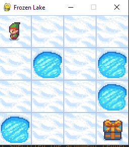
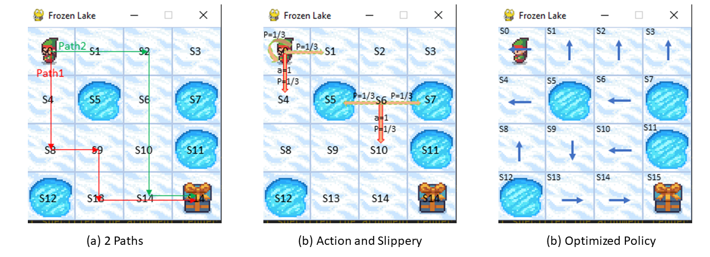

# FrozenLakeFarm

Fig.1 Frozen Lake Env

This environment is part of the Toy Text environments. It has:
- Action Space: Discrete(4): 0:Left, 1:Down, 2:Right, 3: Up
- Observation Space: Discrete(16): current_row * nrows + current_col (starts at 0)
- Import: gym.make("FrozenLake-v1")

Frozen lake involves crossing a frozen lake from Start(S) to Goal(G) without falling into any Holes(H) by walking over the Frozen(F) lake. The agent may not always move in the intended direction due to the slippery nature of the frozen lake.

## Frozen Lake Env Analysis

Fig.2 Frozen Lake Env Analysis

This Fig.2(a) shows 2 paths. Lets see which one should be the optimized path.

Due to the slippery property, the agent will move in intended direction with probability 1/3 or move in either perpendicular direction with equal probability 1/3 in both directions. 
- Like at state `S0`, agent takes down action (a=1), it may arrive at `S4` with probability 1/3, or arrive at `S1` with probability 1/3, or stay at `S0` with probability 1/3. 
- Like at state `S6`, agent takes down action (a=1), it may arrive at `S10` with probability 1/3, or fall into Holes (`S5` or `S7`) with probability 2/3.  

Actually, if at the state `S6`, no matter what action the agent takes, it will fall into Holes with probability at least 1/3.
If at state `S10`, if any of up/right/down action is taken, the agent will fall into Holes with probability 1/3.
These two states are risk states, the agent should avoid them.

So comparing to Path2 with 2 risk states `S6` and `S10`, Path1 would be more optimal. Path1 has state sequences \[S0, S4, S8, S9, S13, S14, S15\]. 
- At `S0`, we expect the agent arrive at next state `S4` without `S1`, so a left action (a=0) is suitable.
- At `S4`, we expect the agent arrive at next state `S8` without `S5`, so a left action (a=0) is suitable.
- At `S8`, we expect the agent arrive at next state `S9` without `S12`, so a up action (a=3) is suitable.
- At `S9`, we expect the agent arrive at next state `S13` without `S5`, so a down action (a=1) is suitable.
- At `S13`, we expect the agent arrive at next state `S14` without `S12`, so a right action (a=2) is suitable.
- At `S14`, we expect the agent arrive at next state `S15` without `S10`, so a down action (a=1) is suitable.
- At `S15`, we expect the agent arrive at next state `S15` without `S11`, so a down action (a=1) is suitable.

So according to the slippery property, we infer to the optimized policy with Path1: \[0, 0, 3, 1, 2, 1, 1\]
 

Moreover, if we define a policy function Pi(s) which means an action the agent should take in state s. 

The optimized policy should be `Pi(S)=\[Pi(S0)=0, Pi(S1)=3, Pi(S2)=3, Pi(S3)=3, Pi(S4)=0, Pi(S5)=?, Pi(S6)=0, Pi(S7)=?, Pi(S8)=3, Pi(S9)=1, Pi(S10)=0, Pi(S11)=?, Pi(S12)=?, Pi(S13)=2, Pi(S14)=1, Pi(S15)=0\]`, like Fig.2 (c), where `?` means no action available because the agent has falled into holes.  

So our work is to find this optimized policy by interaction with frozen lake environment.
